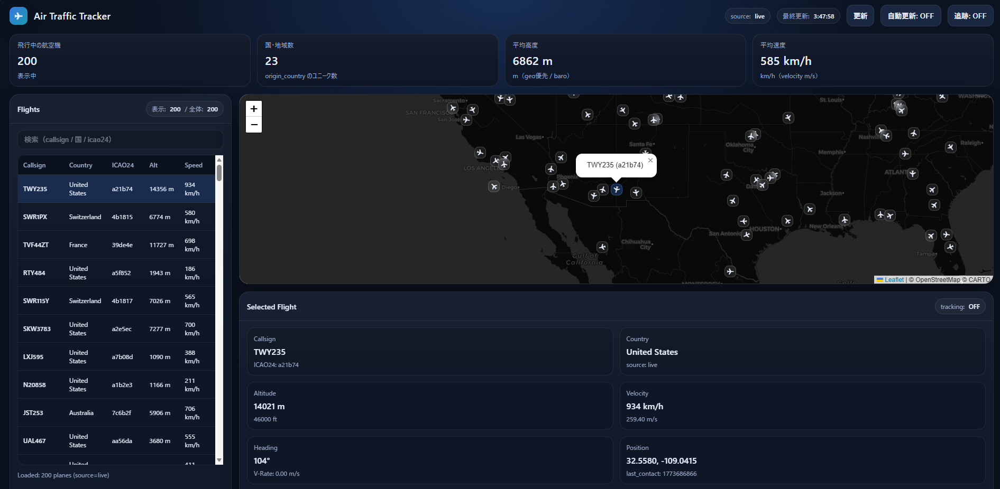

# Air Traffic Tracker
AWSでの実装のやり方を勉強しようと思い、制作を始めました。　

このアプリは、OpenSky Network API を利用して航空機の位置情報を取得します。
一定間隔でデータを更新するため、連続してAPIへアクセスすると、一定時間後に取得できなくなることがあります。そのため、デフォルトでは保存してあるスナップショットファイルを参照するようにしています。

このリポジトリでは、**AWS Lambda / API Gateway 向けの本体コード**を `src/` に置き、**ローカル実行**は `local_server.py` から同じ AWS 用ハンドラを呼び出す構成にしています。

## 構成

```text
air_traffic_tracker/
├─ src/
│  ├─ app.py                      # AWS Lambda 用本体
│  ├─ opensky_states_snapshot.json
│  └─ static/
│     └─ index.html               # フロントエンド
├─ local_server.py                # ローカル実行用ラッパー
├─ requirements.txt
├─ template.yaml                  # AWS SAM テンプレート
├─ samconfig.toml
└─ .gitignore
```

## できること

- 飛行中の航空機一覧を取得
- `icao24` を使って特定機体を追跡
- 地図上に機体位置を表示
- OpenSky API 取得失敗時は snapshot にフォールバック

## API

### `GET /`
UI を表示します。

### `GET /planes`
飛行中の航空機一覧を返します。

レスポンス例:

```json
{
  "source": "live",
  "count": 200,
  "planes": [
    {
      "icao24": "abcdef",
      "callsign": "ANA123",
      "origin_country": "Japan",
      "latitude": 35.0,
      "longitude": 139.0,
      "baro_altitude": 10300,
      "geo_altitude": 10150,
      "velocity": 220,
      "heading": 180,
      "vertical_rate": 0
    }
  ]
}
```

### `GET /track?icao24=<icao24>`
指定した `icao24` の機体情報を返します。

例:

```text
/track?icao24=8401c3
```

## ローカル実行

### 1. 仮想環境を作成

Windows PowerShell:

```powershell
python -m venv venv
venv\Scripts\activate
```

### 2. 依存関係をインストール

```powershell
pip install -r requirements.txt
```

### 3. サーバー起動

```powershell
uvicorn local_server:app --reload
```

### 4. ブラウザで開く

```text
http://127.0.0.1:8000/
```

## AWS デプロイ

このリポジトリは AWS SAM を使ったデプロイを想定しています。

```powershell
sam build
sam deploy
```

## 注意点

- 本体の API 実装は `src/app.py` です。
- ローカル版は独自実装ではなく、`local_server.py` が `src.app.lambda_handler` を呼び出します。
- そのため、**AWS 用とローカル用で同じ機能**を確認できます。

## 使用技術

- Python
- FastAPI
- Uvicorn
- AWS Lambda
- AWS SAM
- OpenSky Network API
- HTML / JavaScript

## Screenshots

